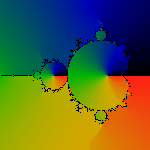
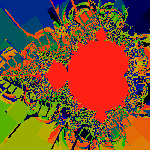
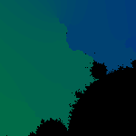
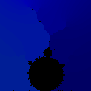
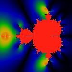
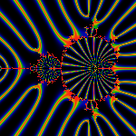
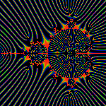
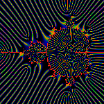
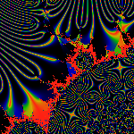

# Douady Hubbard Parameter Rays

[Parameter rays](https://en.wikipedia.org/wiki/External_ray) are simply the curves that run [perpendicular](https://en.wikipedia.org/wiki/Perpendicular) to the [equipotential curves of the M-set](https://linas.org/art-gallery/escape/ray.html). Below, we exhibit their identity to the winding number of the quadratic map.

## the final phase angle
We start this exploration with a picture showing **the final phase angle** when an iterated point finally escapes.  

  

  
  
That is, when we've iterated until  

$`|z_n| > R`$

 we look at the phase of $`t_n`$ of $`z_n = r_n e^{it_n}`$. In this image, black=0, green=pi, red=2pi. In the outermost part of this image, we've iterated twice (n=2), and we can see that the phase circles twice around (i.e. for a total of 4pi). The first visible band shows the phase winding around four times times, the next eight, then sixteen. 

We conclude:  **the phase winds around 2 raised to the power of n-1  times when it takes n iterations for a point to escape**.

"you can see the period doubling of the argument through each iteration. (Look in the image for where the band of red repeats in the level sets.) Why does the phase double every iteration? The iteration of each point proceeds by squaring the point and adding a constant. When you square a complex number, you double its argument. This is why **each iteration doubles the phase of the iterate**." [Richard A Thomson](https://user.xmission.com/~legalize/fractals/mandelbrot-hue.html)

If you look carefully at this picture, several interesting things are happening. 
* First, the interior of the M-set is colored. Ignore this; this is an unrelated artifact of the algorithm. 
* Next, notice how the red-black edges (almost) line up over multiple bands. If we picked a larger R, they would line up invisibly well. Anyway, they seem to line up and point at the tips of shoots.

The 'lining up' and doubling for each iteration allows us to use binary numbers to identify each region. For the outermost region, we can use 0 to denote the upper half, and 1 to denote the lower half. Then, for each subsequent band, we can use 0 if the band lines up to angles less than pi in the previous band, and 1 if it lines up with angles greater than pi in the previous band. Thus, any sequence of binary digits can be used to walk us towards the M-set, with each digit determining which fork should be taken. If we put a decimal point in front of the sequence, then we have a binary expansion of a real number between 0 and 1\. We refer to this number, somewhat incorrectly, as the winding number.

## winding number 
Lets look a this another way: for any real number 0 < x < 1 write down its binary expansion. Then use the digits of the binary expansion to pick one's way down through each band. After an infinite number of steps, we've reached a unique point at the surface of the M-set. For every number, there's a point at the surface.

We use the 'lining-up' or period-doubling to subtract out its effects, and generate the winding number shown here.  
  
Basically, by looking at the first picture, we can see that we can match up the colors by totaling up the winding number as the phase wraps around, and then dividing by 2n-1 for each band.  
The algorithm we used here is the simplest and fastest possible:

*   For each parameter c, and each iteration k
*   we compute the phase tk of zk = rkeitk. We use arctan to compute the phase.

k

k-1

k

The defects are barely visible in the image above, but are prominent in these closeups.    
 The lozenges and wedges shouldn't be there. The shading should be smooth and continuous. In these areas, there seems to be no simple way of discerning a doubling merely by looking at the sequence of zn's, and basically, we mis-count. Note, however, that _except_ for these areas where we obviously mis-count, this simple algorithm does, otherwise, give 'exact' results.  

There seems to be no easy way of simply fixing the algorithm, and not for lack of trying.    
 Here, examples of screwed up algorithms. Beautiful, but meaningless... Heck, this _was_ supposed to be an art-gallery, until we started slinging the expository math about. Sigh. So this image is our contribution to 'Art'. The rest of the images on this page will have to be considered 'technical diagrams'.  

Here's an example of an 'almost' correct algorithm. The idea here is to try to step/integrate along lines of constant phase, moving away from the M-set. We use the vector Dm (employing the notation introduced on the [Potential Page](https://linas.org/art-gallery/escape/ray.html)) as a predictor to step one iteration at a time away from the M-set. The explicit algorithm is this: Define a sequence {ck} with c0 = c and k<n, where n is the number of times that c is iterated until it reaches some (large) escape radius. Then try

ck+1 = ck - 2Dmk/|Dmk|2

where Dmk is the derivative of the fractional iteration count m at ck. With each ck, we iterate one less time, (i.e. we iterate n-k times). Then the phase of cn seems to be an approximation to the true phase. In particular, it is free of the discontinuities plaguing the simple algorithm.    
 Notice how much prettier, and more visually correct these images are, compared to their equivalents above.  

However, this algorithm has some serious spread-out error terms, as shown here.  This image shows the difference between the exact phase, and our approximation. The image is colored so that red represents differences of 2 percent or more between the approximate and the true phase. Although 2 percent may seem small, it is hopelessly large when used for tracing rays.  

The lines of constant phase are exactly what is referred to as the Douady-Hubbard 'external rays'. With a tiny bit of math, its easy to see that these lines of constant phase are exactly perpendicular to the equipotential lines. Using the notation introduced on the [Potential Page](https://linas.org/art-gallery/escape/ray.html), we have

Dtn = i <u>z</u>n Dzn / 2 |zn|2

and we recall that multiplying by i is the same as rotating by 90 degrees.

## Ray Atlas

Rays, 105 spread out evenly at the circle at infinity.  That is, the center of the red lines lies at 2j pi/105 for j=(0..105). Note how a number of these rays land where buds pinch off from the main cardiod. We can easily count these by hand. The j=0 ray lies due east, emanating from the scorpion tail. Then we count. The rays at j=7,14 pinch off the n=4 bud (and thus, we say that the 'arc-angle size' of the n=4 bud is (14-7)/105 = 7/105=1/21). The two rays j=15,30 pinch off the n=3 bud (for an angular size of 15/105=1/7). The two rays j=35,70 pinch off the n=2 bud (for an angular size of 35/105=1/3). With a bit of combinatorial effort, some fairly general expressions for the angular sizes of buds, antennae, and other features on the M-set can be given as exact rational numbers. This is one of the main results of the Douady-Hubbard theory.  

To see that the exact ratios are really exact, compare the pictures above and below.  Here, again we have 105 rays, but slightly askew, so that no simple fractions arise. The angles center of the red days are given by 4j pi/211 for j=(0..105). By the way, notice the Moire patterns in the interior of the M-set. The interior has nothing to do with anything, its just a by-product of the algorithm we use to generate these pictures.  

Here are some rays in the vicinity of the n=3 bud.    
 The one on the left has red = 2j pi/256 for j=(0..256); the one on the right has red = 4j pi/513 for j=(0..256). There are two interesting things about this picture: fractions that have a power-of-two in the denominator seem to be associated with rays that land at the tips of antenna. (We already noticed this above, in the very very first picture). The second interesting thing is that most of the landing rays land on the antenna, not on the bud. From this, we conclude that most of the arc-angle size of the bud is in fact the antenna.  

Here's the n=3 bud when there are 1008=16*9*7 rays distributed around the circle.  As we saw above, the n=3 bud is pinched off by rays [1/7,2/7]. The largest bulblet on top of it is at [10/63,17/63]. This rapidly turns into a game of common multiples: note that 10/63 = 1/7 + 1/63 = 1/7(1+1/9). And symmetrically on the other side: 17/63 = 2/7 - 1/63\. The width of the bulblet is, of course, 1/9. There are three rays that land at the trifurcation of the antenna, they are [81/504, 99/504, 135/504]. We can't help but notice that 81/504 = 10/63+1/504 = 10/63(1+1/8). Notice also, the left hand side of the antenna (the larger side) as a width of 1/14, while the right hand side has a width of 1/28. And finally, the smallest trifurcation visible in this image is at [207/1008, 225/1008, 261/1008]. The widths are 1/56 on the right, and 1/28 on the left. If we were to blow things up to 2016 rays, we'd see a trifurcation coming in on the right hand side of the antenna. Its curious how the size of a smaller wake inside a larger one is always the largest possible, with the simplest 'suitable' fraction.  

Rays in the vicinity of the n=2 bud.  Red = 2j pi/1155 for j=(0..1155). Note that 1155=3*5*7*11. Again, the vast majority of rays are soaked up on antenna. Note that the algorithm defects are quite visible in this closeup. The Moire pattern is also rather pretty.  

## A Detailed Atlas

[Visual Atlas](https://linas.org/art-gallery/escape/phase/atlas.html)

[Angle Tables](https://linas.org/art-gallery/escape/phase/arcs.html)

[Visual Atlas](https://linas.org/art-gallery/escape/phase/atlas.html)

[Angle Tables](https://linas.org/art-gallery/escape/phase/arcs.html)

Be sure to also check the bibliography on the [Potential Page](https://linas.org/art-gallery/escape/ray.html) for more details.

# technical note
GitLab uses:
* the Redcarpet Ruby library for [Markdown processing](https://gitlab.com/gitlab-org/gitlab-ce/blob/master/doc/user/markdown.md)
* KaTeX to render [math written with the LaTeX syntax](https://gitlab.com/gitlab-org/gitlab-ce/blob/master/doc/user/markdown.md), but [only subset](https://khan.github.io/KaTeX/function-support.html)

[Return to Linas' Art Gallery](https://linas.org/art-gallery/index.html)
