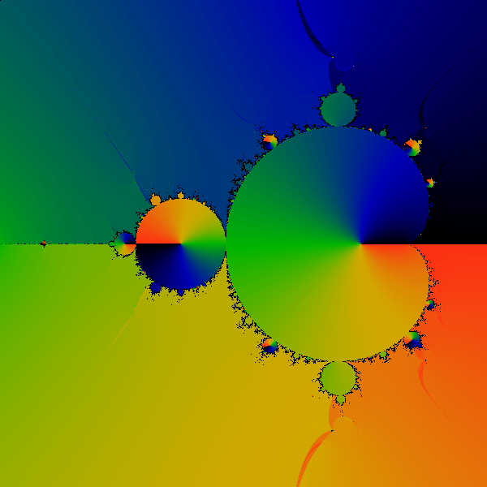

# Project Title

[Linas' Art Gallery](http://linas.org/art-gallery/index.html)

I couldn't run the programs so I made my own based on the description of algorithms

See:
* modified html files in html directory
* md files 
  * [DHParemeterRays](./DHParameterRays.md)
* [Linas Vepstas C programs](http://fraktal.republika.pl/linas.html)
* Images


## [Smooth Shading for the Mandelbrot Exterior](http://linas.org/art-gallery/escape/smooth.html)

Parameter plane ( c plane) with Mandelbrot set for complex quadratic polynomial fc(z) = z^2 + c
* Rectangle part of 2D parameter plane: 
  * [corners](https://en.wikibooks.org/wiki/Fractals/Computer_graphic_techniques/2D/plane#Corners): CxMin = -2.000000;   CxMax = 0.700000;  CyMin = -1.350000; CyMax = 1.350000 
  * [center and radius](https://en.wikibooks.org/wiki/Fractals/Computer_graphic_techniques/2D/plane#radius):  CenterX = -0.650000;   CenterY = 0.000000;  radius = 1.350000
  * [magnification = Mag = zoom](https://en.wikibooks.org/wiki/Fractals/Computer_graphic_techniques/2D/plane#magnification) = 0.740741
* [Pixel Size](https://en.wikibooks.org/wiki/Fractals/Computer_graphic_techniques/2D/plane#Pixel_size) : PixelWidth = 0.002700 and PixelHeight =0.002700
* Escape Radius = 3.000000
* Iteration Max = 18


Bands: Color is proportional to last ( final) iteration = i for which z escapes ( [Level set method = LSM/M or Integer Escape Time](https://en.wikibooks.org/wiki/Fractals/Iterations_in_the_complex_plane/MandelbrotSetExterior#Integer_escape_time_.3D_LSM.2FM_.3D_dwell_bands) ). Level sets ( bands) of escape time  are visible

 


iter18-3e0: Color is proportional to [the renormalized, fractional iteration count](http://linas.org/art-gallery/escape/escape.html) ( [Real Escape Time](https://en.wikibooks.org/wiki/Fractals/Iterations_in_the_complex_plane/MandelbrotSetExterior#Real_Escape_Time)). Level sets ( bands) of escape time  are not visible

 


## [Douady Hubbard Parameter Rays](https://linas.org/art-gallery/escape/phase/phase.html)


Parameter plane ( c plane) with Mandelbrot set for complex quadratic polynomial fc(z) = z^2 + c
* Rectangle part of 2D parameter plane: 
  * corners:  CxMin = -2.400000;   CxMax = 1.500000;  CyMin = -1.950000; CyMax = 1.950000 
  * center and radius:  CenterX = -0.450000;   CenterY = 0.000000;  radius = 1.950000
  * Mag = zoom = 0.512821
* PixelWidth = 0.003900 and PixelHeight =0.003900
* Escape Radius = 3.000000
* Iteration Max = 400


### Phase
Phase: color is proportional to angle ( phase) in turns of last Z ( final Z). Level sets ( bands) of escape time  are visible


Steps
* pick c which is your pixel
* iterate z^2+c until |z| > escape_radius.  Call this the "final z"  . Count the number of iterations until escape. Call this N.
* Use phase(final_z)  as the color scheme at pixel c.  This gives the phase picture.

Clearly, you can see bands encircling the m-set, and each band winds twice as often as the one before. 


Compare with:
* [ External angles in the Mandelbrot set: the work of Douady and Hubbard. by Professor Douglas C. Ravenel](https://web.math.rochester.edu/people/faculty/doug/oldcourses/215s98/lecture10.html)
* [Mandelbrot set decomposition](http://fraktal.republika.pl/mset_decomposition.html)

### final phase after fixed number of iterations without bailout test 

There is no such image in Linas gallery, but I think it could be there

  

Image was made with 
* [phase_f.c](phase_f.c)
* [phase_f.sh](phase_f.sh) and [Image Magic](https://www.imagemagick.org/script/convert.php)

In the right up corner each frame one can see a number wich shows maximal number of iterations for this frame.

compare it with 
* [Formation of Mandelbrot set](https://christopherolah.wordpress.com/tag/sage/) by Christopher Olah
* [Phase Angle Shading](http://www.fractalforums.com/index.php?action=gallery;sa=view;id=20141) : Using phase angle of z after it has escaped to shade the image rather than the number of iterations needed for z to escape. by wes
* [Mandelbrot function ](http://www.quadibloc.com/math/mbint.htm) by John J. G. Savard
* [algorithm 9 : zeros of qn(c) from program Mandel by WOlf Jung](https://en.wikibooks.org/wiki/Fractals/mandel#algorithm_9_:_zeros_of_qn.28c.29)
* [Mandel image by GONZALO E. MENA](https://gomena.github.io/gifs/fractals1/) where at each iteration (frame of the gif) different colors correspond to the angle of the iterations at each point

Note 2 differences
* in my image exterior comes black not white as in Gonzalo image
* in my image ther is no black part near center of main cardioid. Such structure can be seen on other images. 

### Winding

How to remove from phase image: 
* level sets of escape time
* doubling of bands ...


winding number = cnt (integer)


Steps
* pick c which is your pixel.  set integer cnt=0
* iterate z^2+c until |z| > escape_radius.  Call this the "final z"  . Count the number of iterations until escape. Call this N.
* Use phase(final_z)  as the color scheme at pixel c.  This gives the very first picture.
* For each iteration
  * adjust so that phase(z) lies between 0 and 2pi.
  * if (phase(z) > pi) then cnt+=1;  because the next iteration will cause the phase to go over 2pi. 
  * set  cnt = 2*cnt; because the next iteration is doubling the angle.
*Repeat until escape.

$`angle(c) =  (2 pi * cnt + phase(final_z))  / 2^N`$

Note that if N is large, then phase(final_z)/2^N is small, and you can  ignore it. then one simply has:

$`angle( at c) =  2 pi * cnt / 2^N`$

and that is all.





Small defects are barely visible in the image above, but are prominent in the closeups. 


# Getting Started

These instructions will get you a copy of the project up and running on your local machine for development and testing purposes. See deployment for notes on how to deploy the project on a live system.

# Prerequisites

What things you need to install the software and how to install them
* c compiler: gcc
* Image Magic ( for file conversion)

Here is example how to use old ( from 1996) original c code 

```
gcc image.c -lm -Wall
./image image.flo 1000 1000
./flo2mtv image.flo > image.mtv
 convert image.mtv image.png 
```

I could not run new code ( 2000)

### Installing

A step by step series of examples that tell you have to get a development env running

Say what the step will be

```
Give the example
```

And repeat

```
until finished
```

End with an example of getting some data out of the system or using it for a little demo

### Git
```
git init
git remote add origin git@gitlab.com:adammajewski/LinasArtGallery_MandelbrotSet.git
git add html
git commit -m "html"
git push -u origin master
```


### HTML preview

[GitHub & BitBucket HTML Preview](http://htmlpreview.github.io/?)


## Running the tests

Explain how to run the automated tests for this system

### Break down into end to end tests

Explain what these tests test and why

```
Give an example
```

### And coding style tests

Explain what these tests test and why

```
Give an example
```

## Deployment

Add additional notes about how to deploy this on a live system

## Built With

* [n](link) - description

## Contributing

Please read [CONTRIBUTING.md](link) for details on our code of conduct, and the process for submitting pull requests to us.

## Versioning

We use [name](link) for versioning. 

## Authors

* 

See also the list of [contributors](https://github.com/your/project/contributors) who participated in this project.

## License

This project is licensed under the  Creative Commons Attribution-ShareAlike 4.0 International License - see the [LICENSE.md](LICENSE.md) file for details

## Acknowledgments

* Hat tip to anyone who's code was used
* Inspiration
* etc

# technical note
GitLab uses:
* the Redcarpet Ruby library for [Markdown processing](https://gitlab.com/gitlab-org/gitlab-ce/blob/master/doc/user/markdown.md)
* KaTeX to render [math written with the LaTeX syntax](https://gitlab.com/gitlab-org/gitlab-ce/blob/master/doc/user/markdown.md), but [only subset](https://khan.github.io/KaTeX/function-support.html)


