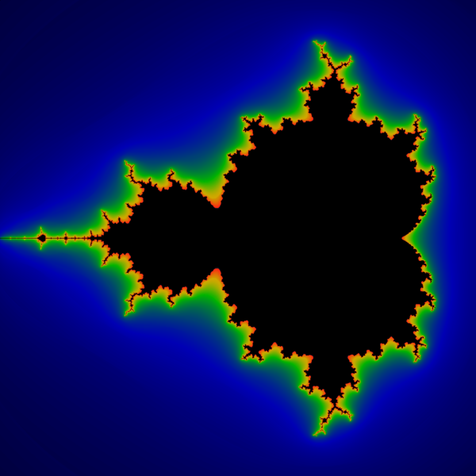
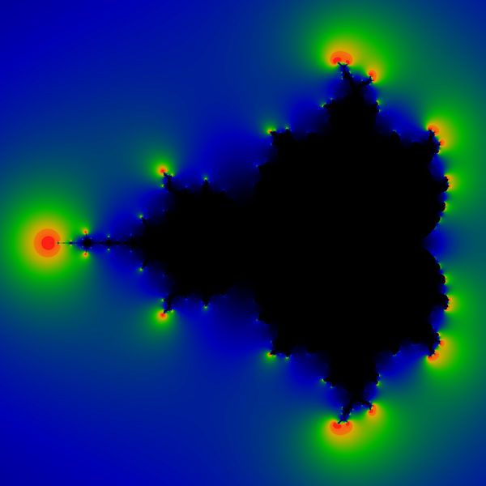

# TOC
* [Smooth Shading for the Mandelbrot Exterior](README.md#smooth-shading-for-the-mandelbrot-exterior)
* [Douady-Hubbard Potential]()
  * [Potential](README.md#potential)
  * [Gradient of the potential](README.md#gradient-of-the-potential)
  	* [Modulus of the gradient](README.md#modulus-of-the-gradient)
  	* [Argument of the gradient](README.md#argument-of-the-gradients)
  * [Integral flow - to do ](README.md#integral-flow)
* [Douady Hubbard Parameter Rays](README.md#douady-hubbard-parameter-rays)
  * [Phase ](README.md#phase)
  * [Winding number or the external angle - not works](README.md#winding-number-or-the-external-angle)
* [Prerequisites](README.md#prerequisites)
* [Acknowledgments](README.md#acknowledgments)
* [License](README.md#license)
* [technical notes](README.md#technical-notes)


[Linas' Art Gallery](http://linas.org/art-gallery/index.html)

I couldn't run the Linas' programs so I made my own based on the description of algorithms

See:
* modified html files in html directory
* md files 
  * [DHParemeterRays](./DHParameterRays.md)
* [Linas Vepstas C programs](http://fraktal.republika.pl/linas.html)
* Images: static (png) and animated (gif)
* c and sh files 


# Smooth Shading for the Mandelbrot Exterior


[Linas original page](http://linas.org/art-gallery/escape/smooth.html)

## Bands 
Parameter plane ( c plane) with Mandelbrot set for complex quadratic polynomial fc(z) = z^2 + c
* Rectangle part of 2D parameter plane: 
  * [corners](https://en.wikibooks.org/wiki/Fractals/Computer_graphic_techniques/2D/plane#Corners): CxMin = -2.000000;   CxMax = 0.700000;  CyMin = -1.350000; CyMax = 1.350000 
  * [center and radius](https://en.wikibooks.org/wiki/Fractals/Computer_graphic_techniques/2D/plane#radius):  CenterX = -0.650000;   CenterY = 0.000000;  radius = 1.350000
  * [magnification = Mag = zoom](https://en.wikibooks.org/wiki/Fractals/Computer_graphic_techniques/2D/plane#magnification) = 0.740741
* [Pixel Size](https://en.wikibooks.org/wiki/Fractals/Computer_graphic_techniques/2D/plane#Pixel_size) : PixelWidth = 0.002700 and PixelHeight =0.002700
* Escape Radius = 3.000000
* Iteration Max = 18


Bands: Color is proportional to last ( final) iteration = i for which z escapes ( [Level set method = LSM/M or Integer Escape Time](https://en.wikibooks.org/wiki/Fractals/Iterations_in_the_complex_plane/MandelbrotSetExterior#Integer_escape_time_.3D_LSM.2FM_.3D_dwell_bands) ). Level sets ( bands) of escape time  are visible

 


Names :
* Level sets of escape time ( Level Set Method = LSM)
* 

## Smooth

iter18-3e0: Color is proportional to [the renormalized, fractional iteration count](http://linas.org/art-gallery/escape/escape.html) ( [Real Escape Time](https://en.wikibooks.org/wiki/Fractals/Iterations_in_the_complex_plane/MandelbrotSetExterior#Real_Escape_Time)). Level sets ( bands) of escape time  are not visible


One of the smoothest, most mathematically correct formulas is the "renormalized" iteration count. For the iterated equation 

$`z_{n+1} = z_n ^ 2 + c`$ 

the renormalized count m is given by

$`m = N + 1 - \frac{log(log |z_N|)}{ log 2}`$


where:
* N is the usual "escape count", the smallest n such that R < |zn| 
* $`z_N`$ is the value of Z when it escaped
* |z| is the modulus of z. (that is, if z=x+iy then |z| = sqrt (x*x+y*y) ).
* R is Escape Radius


 


Compare with:
* [smooth iteration count for generalized Mandelbrot sets by inigo quilez](http://iquilezles.org/www/articles/mset_smooth/mset_smooth.htm)


Names:
* smooth iteration count
* fractional iteration count

# Douady-Hubbard Potential

## Potential

The Douady-Hubbard potential f is just: 


$` f = 2^{-m}`$


In c code : 

```c
  double f = pow(2,-m); // potential 
```

Non-normalized potential : "f gets exponentially flat as it approaches the boundary of the M-set, and thus, it looks like a very blurry low-res picture of the M-set. Boring."

  


Normalized potential : 

```c
m = m/IterationMax; // normalize = map to [0,1]
```


  

Images ware made with: 
* [potential.c](potential.c)
* [potentialn.c](potentialn.c)
* [phase_f.sh](phase_f.sh) and [Image Magic](https://www.imagemagick.org/script/convert.php)


## Gradient of the potential

The gradient is more interesting. The gradient 2Df always points 'uphill':  
  
   

$` 2Df =  f \frac{\overline{Z}*dZ}{|Z|^2 log(|Z|)} `$

where : 
* g = 2Df is a gradient ( complex number)
* f is a potential ( real number)
* $` \overline{Z}`$ is [the complex conjugate](https://en.wikipedia.org/wiki/Complex_conjugate) of a complex number Z
* 

### Modulus of the gradient

The picture below shows the modulus of the gradient.  

```c
gm = cabs(g);
```

Of course, it resembles [a coronal discharge](https://en.wikipedia.org/wiki/Corona_discharge).  
If one were to cut out a metal plate in the shape of an M-set, apply a high voltage to it, 
it is exactly this that you would see, because it is the areas of high electric field (gradient) where the coronal ionization will occur. 
Maybe make a chic lightning rod for the barn. 


  

Images ware made with: 
* [electric.c](electric.c)

>
Your new colormap is different and ugly-ish. The line between red-and-yellow is much much worse than before.  the red-yellow discontinuity is ... confusing, annoying. .. to me, at least.
>
Linas

(to do !!!)


### argument of the gradients

The next picture encodes the angle of the landing rays on the M-set.  It is nothing more than the phase-angle of the gradient. The color coding is such that black=0, blue=small angle, green=pi, red=2pi. In other words, green points west, and red/black points east, just as it was in the Soviet era.


  

Images were made with: 
* [landing.c](landing.c)


Q: If landing : "encodes the angle of the landing rays on the M-set.  It is nothing more than the phase-angle of the gradient." why the image ( landing.gif)  is not the same as phase ( winding.gif) ?

A: 
>>>
Good question. From very far away, they are the same. They differ sharply  when you get close. 
So:  The gradient is a vector: it always points uphill.  The direction in which it points is the phase-angle.  Imagine being in the mountains - uphill is some compass direction, it could be any direction at all, depending on the valleys, ridges.   As you get close to the M-set, the uphill direction can point pretty much anywhere. Try zooming in on landing.gif, and you will see.   So, you are on the mountain, force yourself to face uphill. If uphill is north, splash blue paint on the ground. If uphill is east, splash green paint on the ground. If uphill is south, splash yellow where you are standing.  The color encodes the uphill direction. 

Now winding.gif is the same as landing.gif very far away.  Up close it is a very different idea.  Up close, the color is "where you came from".   Say you approach a mountain from the north (so you are walking south). Lets call that "yellow".  Now walk uphill, and only straight uphill, and never sideways.  Paint a yellow line behind you as you walk.   That yellow line is the landing ray.  As you walk uphill, continue to paint in yellow. 
You might face north, south, east, whatever, but the line will always be yellow, because yellow is the color is where you came from.  
No matter where you go, if you go uphill, the line stays yellow.
>>>
 


###  integral flow

The lines of constant phase are exactly what is referred to as the Douady-Hubbard 'external rays'. With a tiny bit of math, its easy to see that these lines of constant phase are exactly perpendicular to the equipotential lines. Using the notation introduced on the Potential Page, we have

$`Dt_n = \frac{i z_n Dz_n }{ 2 |z_n|^2}`$

and we recall that multiplying by i is the same as rotating by 90 degrees


This last image shows some landing rays.  A 'landing ray' is just the integral flow along the gradient lines of the potential; 
i.e. the path a rock rolling down the hill to the M-set would take. We've picked 31 evenly-spaced angles at infinity; 
the red lines indicate the flow along these paths. The color gradations help show the behavior of some neighboring rays: 
i.e. the blue rays are nearby neighbors of the red rays. The spreading as they 'land' on the M-set just helps show that rays become radically divergent. 
The Mandelbrot interior is an artifact of the algorithm, and are not a part of the Douady-Hubbard isomorphism. 
See the Winding Page for more details on the derivation, and more pictures. 


Q: "the integral flow along the gradient lines of the potential" here integral is the line integral ? 

A: 
>>>
Not really. The "line integral" is the integral along any path you walk. You can walk up, down, sideways, anywhere you want, and the line integral is just the sum along that path.

The "integral flow" is a different idea: its the idea that "water always flows directly downhill".  So, if a raindrop hits the side of a mountain, which direction does it flow? Downhill.
 And after that? Still downhill. Always downhill until the ocean.  The integral flow is that path, of always going exactly downhill  (or exactly uphill).

The formal definition of the integral flow requires taking the integral of the gradient in a special way. 
It is defined here: https://en.wikipedia.org/wiki/Integral_curve  see especially the picture there. https://en.wikipedia.org/wiki/Integral_curve#/media/File:Slope_Field.png  The more general case here: https://en.wikipedia.org/wiki/Vector_flow  
So: on a cat, each hair is a vector.  The vector flow is where you go when you go in the direction that the hair is pointing.  
The integral curve is that total path.   For a cat, I guess you always end up at the tail.  Or maybe the feet.  you always move away from the nose.
There is a famous theorem: no matter what, you cannot comb the hair on a ball: you will always get one spot which is bald, and another spot where the hair has to stand straight up. (a horse-lick)
By contrast, you can *always* comb the hair on a donut, with no bald spots or donuts.
If you have some complicated shape, and you don't know what shape it is, but if you can comb the hair on it .. then .. you know its not a sphere ... 

--linas
>>>


# Douady Hubbard Parameter Rays

[Linas original page](https://linas.org/art-gallery/escape/phase/phase.html)


Parameter plane ( c plane) with Mandelbrot set for complex quadratic polynomial fc(z) = z^2 + c
* Rectangle part of 2D parameter plane: 
  * corners:  CxMin = -2.400000;   CxMax = 1.500000;  CyMin = -1.950000; CyMax = 1.950000 
  * center and radius:  CenterX = -0.450000;   CenterY = 0.000000;  radius = 1.950000
  * Mag = zoom = 0.512821
* PixelWidth = 0.003900 and PixelHeight =0.003900
* Escape Radius = 3.000000
* Iteration Max = 400


## Phase
Phase: color is proportional to angle ( phase) in turns of last Z ( final Z). Level sets ( bands) of escape time  are visible


Steps
* pick c which is your pixel
* iterate $`z^2+c`$ until $`|z| > EscapeRadius`$.  Call this the "final z"  . Count the number of iterations until escape. Call this N.
* Use phase(final_z)  as the color scheme at pixel c.  This gives the phase picture.

Clearly, you can see bands encircling the m-set, and each band winds twice as often as the one before. 


Compare with:
* [ External angles in the Mandelbrot set: the work of Douady and Hubbard. by Professor Douglas C. Ravenel](https://web.math.rochester.edu/people/faculty/doug/oldcourses/215s98/lecture10.html)
* [Mandelbrot set decomposition](http://fraktal.republika.pl/mset_decomposition.html)


 

## Winding number or the external angle

(to do !!!!)

How to remove from [phase image](phase.png): 
* level sets of escape time
* doubling of bands inside level sets 

Names: 
* winding number ( external angle)
* cnt = counter, it is an integer value 
* 


### cnt ( )

Steps
* pick c which is your pixel.  set integer cnt=0
* iterate $`z^2+c`$ until $`|z| > EscapeRadius`$.  Call this the $`z_{final}`$  . Count the number of iterations until escape. Call this N.
* Use $`phase(z_{final})`$  as the color scheme at pixel c.  This gives [the phase picture](phase.png)
* For each iteration adjust phase so that phase(z) lies between 0 and 2pi. Then 
  * if (phase(z) > pi) then cnt+=1;  because the next iteration will cause the phase to go over 2pi. 
  * set  cnt = 2*cnt; because the next iteration is doubling the angle.
* Repeat until escape.

$`angle(c) =  (2 pi * cnt + phase(z_{final}))  / 2^N`$

Note that if N is large, then $`phase(z_{final})/2^N`$ is small, and you can  ignore it. then one simply has:

$`angle(c) =  2 pi * cnt / 2^N`$

and that is all.


It was made with:
* [phase_cnt.c](phase_cnt.c)


### simple algorithm  (binary)

The 'lining up' and doubling for each iteration allows us to use binary numbers to identify each region. 

For the outermost region, we can use:
* 0 to denote the upper half
* 1 to denote the lower half. 

Then, for each subsequent band, we can use:
* 0 if the band lines up to angles less than pi in the previous band
* 1 if it lines up with angles greater than pi in the previous band. 

Thus, [any sequence of binary digits can be used to walk us towards the M-set](http://www.fractalforums.com/animations-showcase-(rate-my-short-animation)/binary-decomposition-and-external-angles/), with each digit determining which fork should be taken. 

If we put a decimal point in front of the sequence, then we have a binary expansion of a real number between 0 and 1. We refer to this number, somewhat incorrectly, as the winding number.


Lets look a this another way: for any real number 0 < x < 1 write down its binary expansion. 

Then use the digits of the binary expansion to pick one's way down through each band. After an infinite number of steps, 
we've reached a unique point at the surface of the M-set. For every number, there's a point at the surface. 

We use the 'lining-up' or period-doubling to subtract out its effects, and generate the winding number shown here.  
Basically, by looking at the first picture, we can see that we can match up the colors by totaling up the winding number as the phase wraps around, and then dividing by 2n-1 for each band. 


The algorithm we used here is the simplest and fastest possible:
* For each parameter c, and each iteration k, we compute $`z_k = r^ke^{it_k}`$  and the phase $`t_k = arctan(z_k)`$  
* Since arctan always uses one branch, we try to track period doubling by comparing $`t_k`$ to $`t_{k-1}`$ 
* We know that tk should be increasing usually: $`t_{k-1} < t_k`$ ; and we can use this to count the winding number. 

This algorithm is pretty good; its fast, its simple, but is not perfect, and it has a few small defects. 


Original file  


New file  


Made with:
* [winding.c](winding.c)

Small defects are barely visible in the image above, but are prominent in the closeups. 


### correct algorithm


Here's an example of an 'almost' correct algorithm. The idea here is to try to step/integrate along lines of constant phase, moving away from the M-set. We use the vector Dm (employing the notation introduced on the Potential Page) as a predictor to step one iteration at a time away from the M-set. The explicit algorithm is this: Define a sequence {ck} with c0 = c and k<n, where n is the number of times that c is iterated until it reaches some (large) escape radius. Then try

$`c_{k+1} = c_k - 2Dmk/|Dmk|2`$

where Dmk is the derivative of the fractional iteration count m at ck. 

With each ck, we iterate one less time, (i.e. we iterate n-k times). Then the phase of cn seems to be an approximation to the true phase. In particular, it is free of the discontinuities plaguing the simple algorithm.  

Notice how much prettier, and more visually correct these images are, compared to their equivalents above. 
 

  

However, this algorithm has some serious spread-out error terms, as shown here.  This image shows the difference between the exact phase, and our approximation. The image is colored so that red represents differences of 2 percent or more between the approximate and the true phase. Although 2 percent may seem small, it is hopelessly large when used for tracing rays. 


### final phase after fixed number of iterations without bailout test 

There is no such image in Linas gallery, but I think it could be there

  

Image was made with 
* [phase_f.c](phase_f.c)
* [phase_f.sh](phase_f.sh) and [Image Magic](https://www.imagemagick.org/script/convert.php)

In the right up corner each frame one can see a number wich shows maximal number of iterations for this frame.


Explanation:
* [algorithm 9 : zeros of qn(c) from program Mandel by WOlf Jung](https://en.wikibooks.org/wiki/Fractals/mandel#algorithm_9_:_zeros_of_qn.28c.29)


compare it with 
* [Formation of Mandelbrot set](https://christopherolah.wordpress.com/tag/sage/) by Christopher Olah
* [Analysis of critical point of z→z²+c ](https://commons.wikimedia.org/wiki/File:Mandelbrot-Iterate-01.jpg?uselang=en) by [Georg-Johann Lay](https://de.wikipedia.org/wiki/Benutzer:Georg-Johann/Mathematik#Visualising_complex_functions)
* [Mandelbrot fractal: How is it possible? from math.stackexchange](https://math.stackexchange.com/questions/32062/mandelbrot-fractal-how-is-it-possible)
* [Phase Angle Shading](http://www.fractalforums.com/index.php?action=gallery;sa=view;id=20141) : Using phase angle of z after it has escaped to shade the image rather than the number of iterations needed for z to escape. by wes
* [ Creating the Mandelbrot set](http://web.ncf.ca/fs039/mp/documents/ptr/) by Martin Pergler
* [Mandelbrot function ](http://www.quadibloc.com/math/mbint.htm) by John J. G. Savard
* [Mandel image by GONZALO E. MENA](https://gomena.github.io/gifs/fractals1/) where at each iteration (frame of the gif) different colors correspond to the angle of the iterations at each point

Note 2 differences
* in my image exterior comes black not white as in Gonzalo image
* in my image ther is no black part near center of main cardioid. Such structure can be seen on other images.

See:
* the differencesc between odd and even frames


# functions
* atan function : [returns the principal arc tangent of x, in the interval [-pi/2,+pi/2] radians.](https://www.tutorialspoint.com/c_standard_library/c_function_atan.htm)


# Prerequisites

What things you need to install the software and how to install them
* c compiler: gcc
* Image Magic ( for file conversion)

Here is example how to use old ( from 1996) original c code 

```
gcc image.c -lm -Wall
./image image.flo 1000 1000
./flo2mtv image.flo > image.mtv
 convert image.mtv image.png 
```

I could not run new code ( 2000)


# Acknowledgments

* Hat tip to anyone who's code was used
* Inspiration
* etc

# License

This project is licensed under the  Creative Commons Attribution-ShareAlike 4.0 International License - see the [LICENSE.md](LICENSE.md) file for details

# technical notes
GitLab uses:
* the Redcarpet Ruby library for [Markdown processing](https://gitlab.com/gitlab-org/gitlab-ce/blob/master/doc/user/markdown.md)
* KaTeX to render [math written with the LaTeX syntax](https://gitlab.com/gitlab-org/gitlab-ce/blob/master/doc/user/markdown.md), but [only subset](https://khan.github.io/KaTeX/function-support.html)


## Git
```
git init
git remote add origin git@gitlab.com:adammajewski/LinasArtGallery_MandelbrotSet.git
git add html
git commit -m "html"
git push -u origin master
```


## HTML preview

[GitHub & BitBucket HTML Preview](http://htmlpreview.github.io/?)

